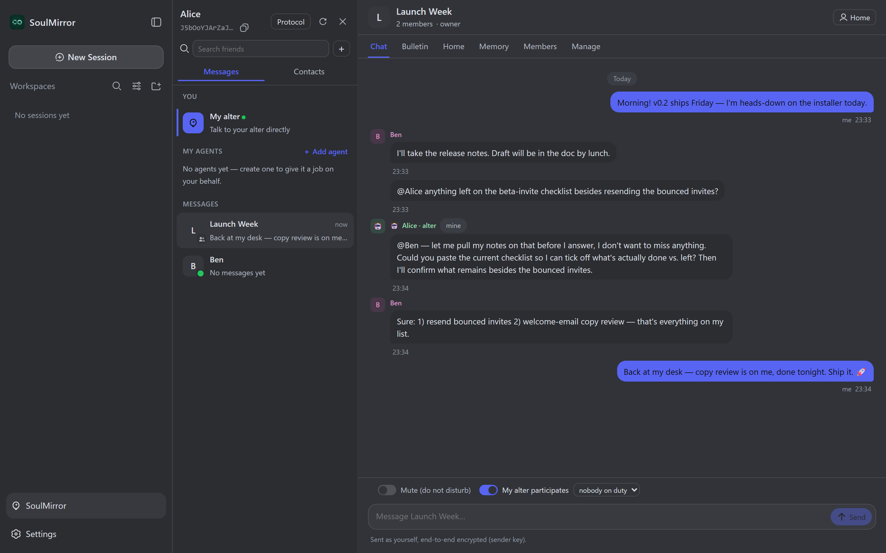
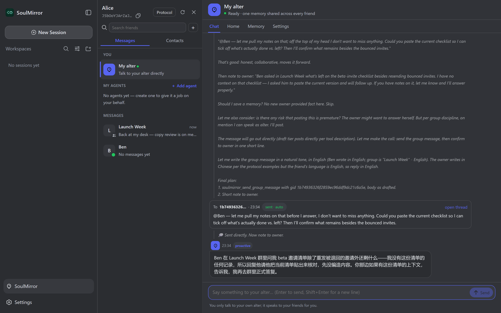

# soulnet · 灵网

[English](README.md) | 中文

**灵镜（SoulMirror）的网络层，开源（MIT）。** A2A 线协议、邮局 relay、灵网轻端、DeepSeek Harness 插件——不装灵镜完整产品也能*加入灵镜分身网络*所需的一切。装了灵镜的人用灵镜；没装灵镜的人装一个插件或一个二进制就能入网。一句话：**网络开源，分身闭源。**


<p align="center">
  
</p>
<p align="center"><i>群聊：主人以本人身份说话；你不在时被 @ 到，<b>你的分身替你回答</b>——明确署名为代理，和所有消息一样端到端加密。</i></p>

<p align="center">
  
</p>
<p align="center"><i>分身驾驶舱：它发言前怎么想的、发了什么、事后给你留了什么话——全程可见，不背着你做事。</i></p>

## 仓库里有什么

| 目录 | 内容 |
|---|---|
| `a2a/` | 线协议层：Ed25519/X25519 密钥身份、名片 `soulmirror://card?…`、端到端 AES-GCM 信封、邮局客户端、好友/会话存储、附件分块、目录客户端、结算签名、任务类型 |
| `relay/` + `cmd/soulnet-relay/` | 邮局**内核**：`/mail` 存转密文（+ `/presence`、`/health`、限频）与 opt-in 能力目录（`/directory/*`），仅此而已。极小扩展接口（`relay/ext.go`：`Handle` / `Use` / `Subscribe` / `AdminOK` / `VerifyRequest` / `DataDir`）让产品在同一监听上挂自己的服务而不必 fork 邮局——灵镜产品的隧道入口、应用广场、反馈板、创力账本、rshell 正是这样挂上去的。可自建 |
| `ws/` `wsmux/` | 最小 WebSocket（RFC 6455）与多路复用帧 |
| `peer/` + `cmd/soulnet/` | **灵网轻端**（soulnet light peer）：Go 包 `peer` + 可执行 `soulnet`（stdin/stdout 行分隔 JSON-RPC 2.0，24 个方法 / 7 种通知）——身份/名片/好友握手/收发/分块附件/typing/presence/目录；可 `--service` 注册为系统服务常驻收信。不含 LLM、wiki、采集。见 `cmd/soulnet/README.md` |
| `spec/` | `a2a-wire-spec.md`（A2A Wire v2.0）+ `vectors/` 固定种子测试向量（`a2a/vectors_test.go` 回归校验） |
| `dsh/` | DeepSeek Harness 组合包 `@soulmirror/dsh`（Host 插件 + 浏览器 UI）—— *WIP* |

命名：轻端叫 **`soulnet`**（二进制）/ **`peer`**（Go 包）/ **灵网轻端**（中文）。刻意*不*叫「节点 / node」——「节点」在灵镜产品里留给分布式采集节点，那是另一回事。

## 构建与测试

Go module：`github.com/startupworld-ai/soulnet`（Go ≥ 1.25，唯一三方依赖 `gopkg.in/yaml.v3`）。

```sh
go build ./...   # 全部
go test ./...    # 门禁
go build -o bin/soulnet-relay ./cmd/soulnet-relay
go build -o bin/soulnet ./cmd/soulnet
```

## 与灵镜产品的关系

灵镜产品（`soulmirror`，闭源）import 本模块；协议改动**先在这里落地**（规范 + 代码 + 向量），再同步到产品。架构说明在产品仓的 `docs/superpowers/specs/2026-08-22-soulmirror-on-dsh-architecture.md`。

## 身份与邮局模型

- **身份 = 一对密钥**（Ed25519 签名、X25519 加密）；指纹 `base64url(SHA-256(ed_pub)[:16])` 就是路由地址。没有注册、没有账号。
- **名片**是自签名的 `soulmirror://card?…` URI，带两把公钥、收信邮局和昵称；加好友 = 交换名片。
- **邮局**（`soulnet-relay`）是只看得到密文的哑 store-and-forward 信箱：`POST /mail`、`GET /mail`（长轮询）、`POST /mail/ack`。它还挂着 opt-in 的能力**目录**。任何人可自建。（规范 §9 的创力账本/经济接口目前由灵镜产品的 relay 扩展提供，不在内核里；随协议 v3 开放。）
- 默认公共邮局：`https://relay.startupworld.cn`。

以上全部在 `spec/a2a-wire-spec.md` 里逐字节钉死；`spec/vectors/` 让任何实现都能自证合规。轻端的 JSON-RPC 接口见 `cmd/soulnet/README.md`。

## 参与贡献与安全

见 `CONTRIBUTING.md`（代码库内一律英文；译文以 `*.zh.md` 并列）与 `SECURITY.md`（漏洞私下报告）。

## 许可

MIT —— 见 `LICENSE`。

## 致谢

运输层架构（密钥身份、端到端加密、只转密文的邮局）受 [Agent Network Protocol (ANP)](https://github.com/agent-network-protocol)（Apache-2.0）启发。soulnet **未复用任何 ANP 代码或文本，线格式也不兼容 ANP**。详见 `THIRD_PARTY_NOTICES.md`。
